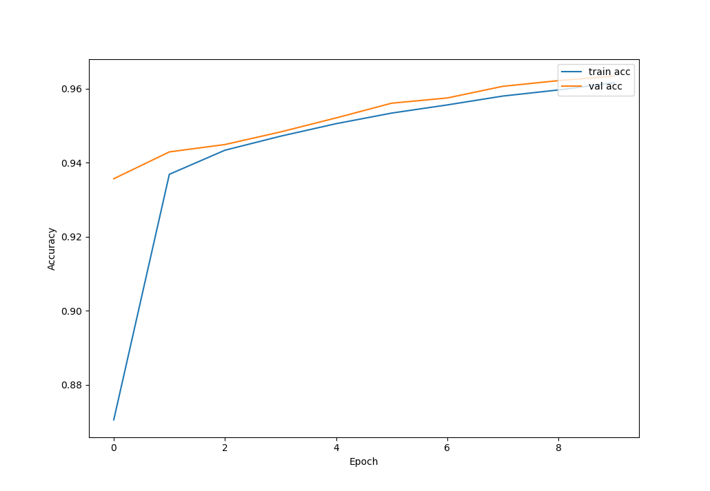
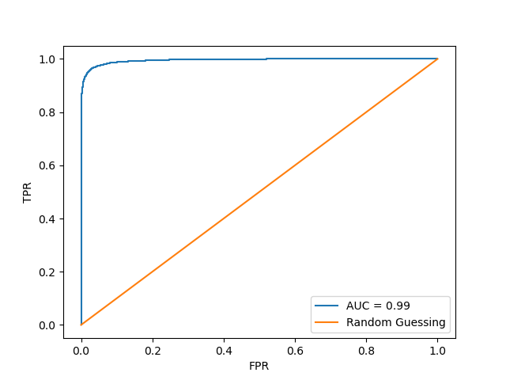

# Stegano Detector  
VT CS 4264 Term Project Spring 2021  
Keras Neural Network to detect LSB steganography generated with the stegano library  

__Usage__  
To create a dataset from a folder of jpegs: run bash_scripts/create_data.sh or follow complete instructions in instructions.txt  
Train model: python3 learnSteg.py -data data/ -name models/Test -epochs 10 -batch_size 64 -learning_rate 0.00001 -img_size 224  
Predict on an image: python3 predict.py -image image.png -model_name models/Test -bpp 1.0  
  
__Results__  
For pure stegano-lsb:  

For stegano-lsbset with the identity and composite generators:  

  
